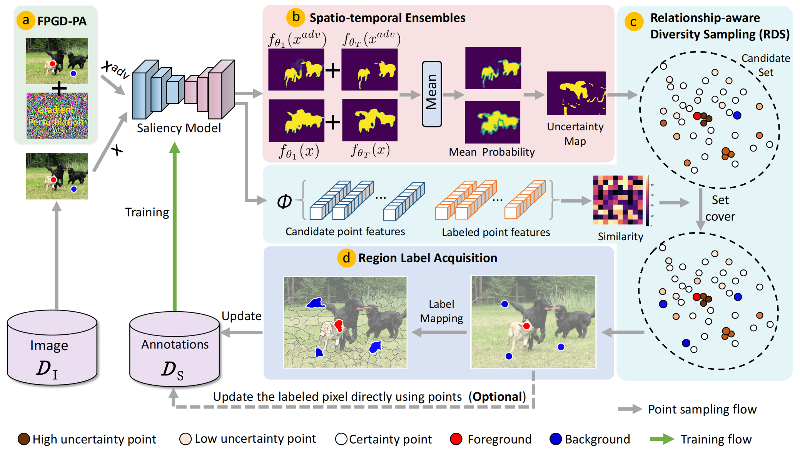
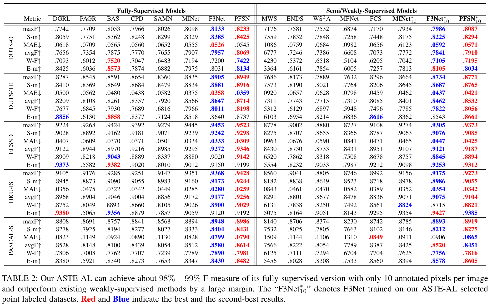

## <p align=center> `Pixel Is All You Need: Adversarial Spatio-Temporal Ensembles Active Learning for Salient Object Detection` </p>
> #### Zhenyu Wu, Wei Wang, Lin Wang, Yacong Li, Fengmao Lv, Qing Xia, Chenglizhao Chen, Aimin Hao, Shuo Li </sup>


<font size=7><div align='center' > <a href=https://arxiv.org/abs/2212.06493>**Paper**</a> | [**Pre-trained Model**](#training) | [**Training**](#training) | [**Testing**](#Testing) | [**Dataset**](#dataset) | </div></font>

## Abstract

Although weakly-supervised techniques can reduce the labeling effort, it is unclear whether a saliency model trained with weakly-supervised data (e.g., point annotation) can achieve the equivalent performance of its fully-supervised version. This paper attempts to answer this unexplored question by proving a hypothesis: there is a point-labeled dataset where saliency models trained on it can achieve equivalent performance when trained on the densely annotated dataset. To prove this conjecture, we proposed a novel yet effective adversarial spatio-temporal ensembles active learning (ASTE-AL). Our contributions are three-fold:  1) Our proposed adversarial attack triggering uncertainty can conquer the overconfidence of existing active learning methods and accurately locate these uncertain pixels. 2) Our proposed spatio-temporal ensembles strategy not only achieves better performance than the traditional deep ensembles but significantly reducing the computational cost. 3) Our proposed relationship-aware diversity sampling algorithm can conquer oversampling while boosting model performance.
Experimental results show that our ASTE-AL can find such a point-labeled dataset, where a saliency model trained on it obtained 98\%-99\% performance of its fully-supervised version with only ten annotated points per image. 

## Framework Overview





## Usage

## Prerequisites
- [Python 3.5](https://www.python.org/)
- [Pytorch 1.3](http://pytorch.org/)
- [OpenCV 4.0](https://opencv.org/)
- [Numpy 1.15](https://numpy.org/)
- [TensorboardX](https://github.com/lanpa/tensorboardX)
- [Apex](https://github.com/NVIDIA/apex)
- [adversarial-robustness-toolbox](https://github.com/Trusted-AI/adversarial-robustness-toolbox)


## Clone repository

```shell
git clone https://github.com/wuzhenyubuaa/ASTE-AL.git
cd F3Net/
```

## Dataset

Download the following datasets and unzip them into `data` folder

- [PASCAL-S](http://cbi.gatech.edu/salobj/)
- [ECSSD](http://www.cse.cuhk.edu.hk/leojia/projects/hsaliency/dataset.html)
- [HKU-IS](https://i.cs.hku.hk/~gbli/deep_saliency.html)
- [DUT-OMRON](http://saliencydetection.net/dut-omron/)
- [DUTS](http://saliencydetection.net/duts/)

## Dataset configuration

- For the training setup, update the `--dir_dataset` parameter in the `train.py` file to your training data path, e.g., `dir_dataset='./your_path/DUTS'`.
- For the testing, place all testing datasets in the same folder, and update the `--test_dataset_root` parameter in the `test.py` file to point to your testing data path, e.g., `test_dataset_root='./your_testing_data_path/'`.


## Training

```shell
    cd src/
    python3 train.py
```
- `ResNet-50` is used as the backbone of F3Net and `DUTS-TR` is used to train the model, you can replace the F3Net with other networks.
- `batch=32`, `lr=0.05`, `momen=0.9`, `decay=5e-4`, `epoch=32`
- Warm-up and linear decay strategies are used to change the learning rate `lr`
- After training, the result models will be saved in `out` folder

## Testing

```shell
    cd src
    python3 test.py
```
- After testing, saliency maps of `PASCAL-S`, `ECSSD`, `HKU-IS`, `DUT-OMRON`, `DUTS-TE` will be saved in `./experiments/` folder.


## Evaluation
- To evaluate the model performace, please use MATLAB to run `main.m`
```shell
    cd eval
    matlab
    main
```

## Pre-trained model


## Result

+ Comparison with the previous state-of-the-art methods with different training sets:




## Acknowledgement

We appreciate the codebases of [F3Net](https://github.com/weijun88/F3Net), [MINet](https://github.com/lartpang/MINet) and [PFSN](https://github.com/iCVTEAM/PFSNet).

### Citation

```
@inproceedings{wu2023pixel,
  title={Pixel is all you need: adversarial trajectory-ensemble active learning for salient object detection},
  author={Wu, Zhenyu and Wang, Lin and Wang, Wei and Xia, Qing and Chen, Chenglizhao and Hao, Aimin and Li, Shuo},
  booktitle={Proceedings of the AAAI Conference on Artificial Intelligence},
  volume={37},
  number={3},
  pages={2883--2891},
  year={2023}
}
```


